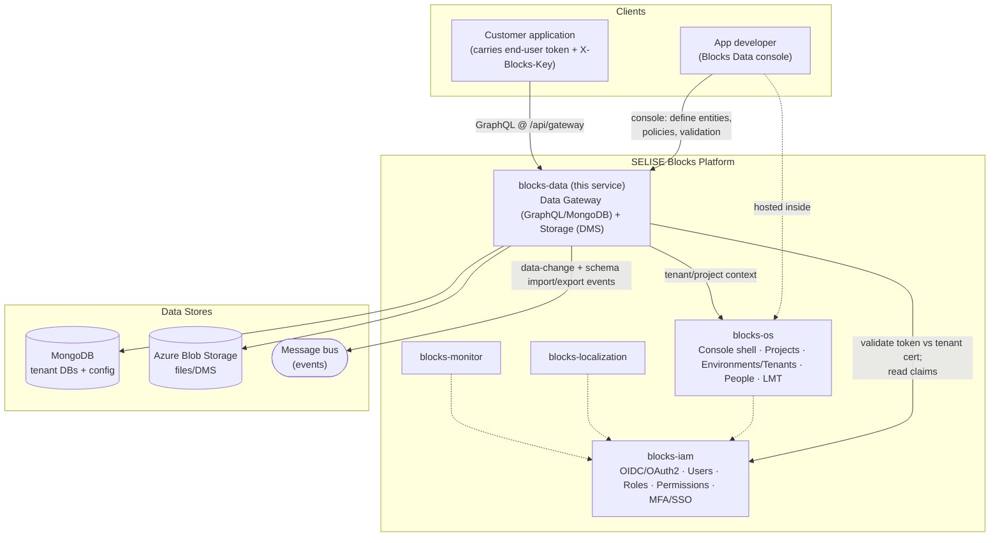
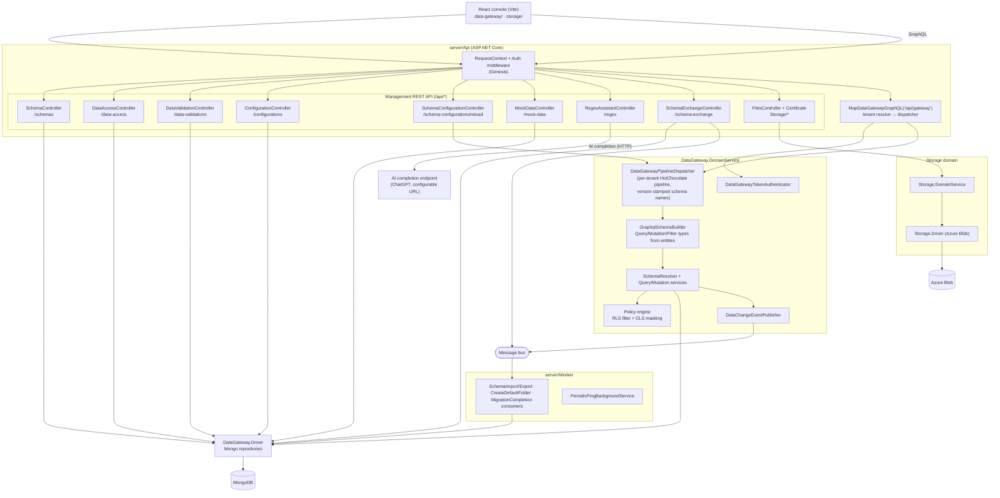
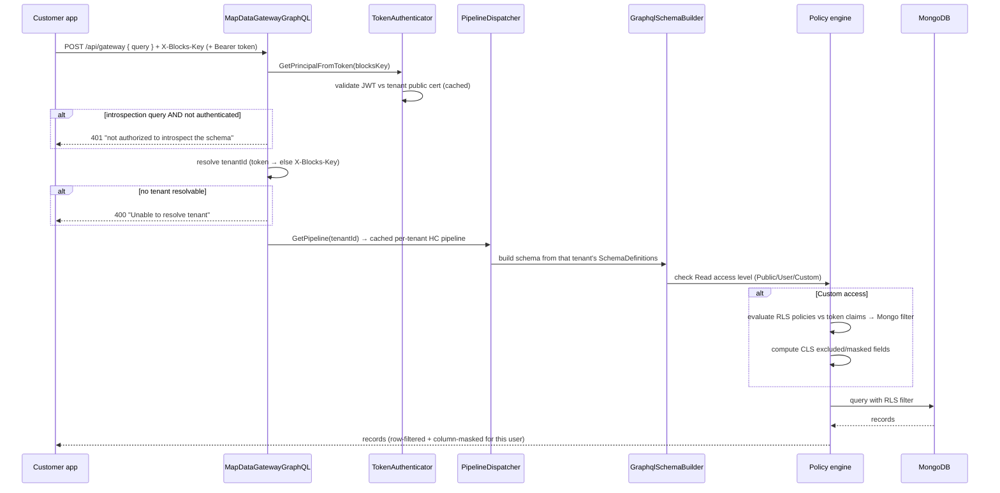
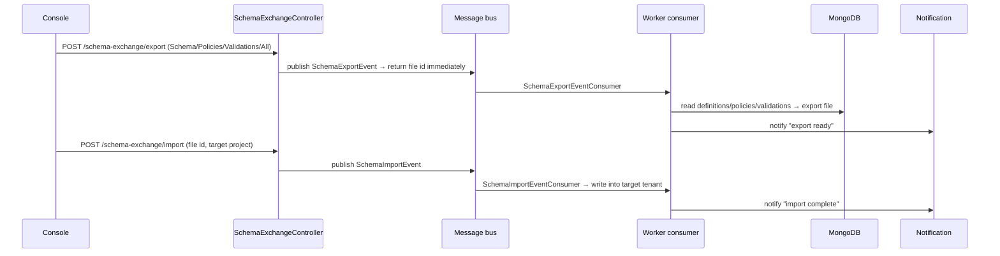

# Blocks Data — Architecture Specification

> **Product name:** **Blocks Data** is the customer-facing brand. `blocks-data` is the code/key identifier (service name, permission prefix, X-Blocks-Key registration). Blocks Data has **two domains**: the **Data Gateway** (structured data — visually-defined entities served over a dynamic **GraphQL** API on MongoDB) and **Storage** (unstructured data — an object/file manager, "DMS"). The legacy term **"Unified Data Service (UDS)"** is retired in favour of "Blocks Data"; it still appears in a few client constants (`API_BASES.UDS`, `dev-uds`) and is a known cleanup gap.
>
> **Grounding & target state:** This document reflects the code on the `inception` branch and the authoritative product decisions (answered tickets #212–#224). Where the two disagree, the decision is the **target** and the divergence is called out as an **Open / gap** note — stale behaviour is never described as if intended. The biggest such items: the platform is now **GraphQL-only** (the parallel REST gateway has been removed), and **build/release/deploy is fully removed** — the `/reload` endpoint that remains is a schema-apply operation, not a deployment.

---

## 1. System Context

SELISE Blocks is a multi-tenant cloud application platform of five services. Each is .NET (`server/`) + React/Vite (`client/`), multi-tenant via an `X-Blocks-Key` tenant key, and authenticates through blocks-iam over OIDC. Blocks Data is the platform's **data layer**: it lets an app developer stand up a governed, per-tenant data API without writing backend code.

Its role relative to the siblings:

- **blocks-os** defines *where* — Project / Environment (tenant) / People. Every schema and data source in Blocks Data is scoped to a tenant that originates in blocks-os, and the console runs inside the blocks-os shell.
- **blocks-iam** defines *who you are and what you may do* — it is the OIDC authorization server. Blocks Data validates blocks-iam-issued access tokens against the tenant's public certificate and reads claims (UserId, Email, Roles, Permissions, TenantId) to drive row/column security. Console operations are gated by `blocks-data::*` permission scopes that IAM enforces.
- **blocks-data** defines and serves *the data itself* — the entities, the stored records, the files, and the GraphQL API that customer apps call.
- **blocks-localization / blocks-monitor** are peers with no code-level coupling. Blocks Data emits structured logs/traces (via the shared Genesis/LMT tooling) that the platform's observability surface consumes.



**Minimum footprint (D4):** Blocks Data is always used inside a blocks-os project and depends on blocks-iam for identity. It is not a standalone product.

---

## 2. Component Architecture

The repository ships **two runnable processes** plus shared domain/driver libraries:

- **`server/Api`** — the ASP.NET Core host (`Program.cs`). Serves (a) the React SPA from `wwwroot`, (b) the REST **management API** (`MapControllers`, prefixed `/api`), and (c) the dynamic per-tenant **GraphQL data gateway** mapped at `/api/gateway` *after* the auth middleware so the token is available.
- **`server/Worker`** — a background host (MassTransit-style consumers) for async jobs: schema export/import, default-folder creation, migration completion, plus a `PeriodicPingBackgroundService`.
- **`server/DataGateway.DomainService`** — the structured-data domain: schema builder, GraphQL types/resolvers, query/mutation services, policy/validation engine, tenant pipeline dispatcher.
- **`server/DataGateway.Driver`** — MongoDB repository/driver plumbing.
- **`server/Storage.DomainService` + `server/Storage.Driver`** — the DMS/object-file domain over **Azure Blob Storage** (pre-signed uploads, folders, download, metadata).
- **`client/`** — Vite/React console: `data-gateway/` (entities, structure editor, access control, validation, GraphQL playground, records browser, data-source config) and `storage/` (file manager), hosted in the shared blocks-kit console shell.

The management controllers and the runtime gateway share the same MongoDB entities but are two distinct request surfaces.



**Gap notes (management API):**
- `Certificate` controller (Storage) uploads a certificate; per **#215/#219** it must be renamed `CertificateController` and protected with `blocks-data::storage::upload-certificate` (target — not yet applied).
- Storage controllers still use `[controller]/[action]` routes; per **#218** they adopt kebab-case resource routes while keeping the old routes marked obsolete (30–40 day removal window). `DeleteMockData` should become `POST .../delete` and `generateregex` should become `generate-regex`. `BaseResponse`/`DmsResponse` are being replaced by `ServiceResponse<T>` (partially done — controllers return `ServiceResponse<T>`, `DmsResponse.cs` still present).

---

## 3. Key Runtime Flows

### 3.1 Define an Entity and publish it (console)

Schema changes are applied **manually** via an explicit **Publish** action that calls `/schema-configurations/reload`. There is no auto-deploy for any change, breaking or non-breaking (**#213**). Reload is *not* a deployment — it evicts the cached GraphQL executor and rebuilds the tenant schema from MongoDB.

```mermaid
sequenceDiagram
    participant Dev as App developer (console)
    participant API as Api (management controllers)
    participant Mongo as MongoDB
    participant Disp as PipelineDispatcher
    participant HC as HotChocolate executor

    Dev->>API: POST /configurations (data source: connection + db name)
    API->>Mongo: persist DataServiceConfiguration
    Dev->>API: POST /schemas/info (Entity or Object/DTO)
    Dev->>API: POST /schemas/fields (typed fields, arrays, nested Object refs)
    Dev->>API: (optional) /data-validations, /data-access (RLS/CLS policies)
    API->>Mongo: persist SchemaDefinition + SchemaChangeLog (unadapted)
    Note over Dev,API: Console shows an "unpublished changes" badge<br/>(unadapted-change-logs)
    Dev->>API: POST /schema-configurations/reload  [blocks-data::...::reload]
    API->>Disp: BumpVersionAndClearPipeline(tenantId) → tenantId__vN
    API->>HC: TriggerEviction(old schema name)
    Note over Disp,HC: Next gateway request builds a fresh executor;<br/>AdaptSchemaChangeLogsToServer marks changes adapted → badge clears
```

**Terminology:** an **Entity** (`SchemaType.Entity`) maps to a stored MongoDB collection (naming pattern `sb_{SchemaName}s`). An **Object** (`SchemaType.Dto` in code) is a reusable nested shape embedded inside an Entity, not stored on its own. Per **#224** the UI must not use the word "Table"; use **Entity**. The CRUD relabel (Read/Write/Edit/Delete → Create/Read/Update/Delete) is **frontend-only** — backend enums (`PolicyOperation`, the four `*AccessLevel` fields) are unchanged and no data migration is required.

### 3.2 Runtime read with per-tenant isolation + RLS/CLS (GraphQL gateway)

One process serves all tenants. Every request goes to the same `/api/gateway` path; the tenant is resolved from the token when authenticated, otherwise from the `X-Blocks-Key` header. Schema **introspection is refused for unauthenticated callers** (deliberate — do not leak the data model).



**Access levels** (`SchemaAccessLevel`, per operation): **Public** = anyone may CRUD; **User** (logged-in) = only authenticated tenant users; **Custom** = per-operation allow/deny policies (e.g. only the data owner may edit; column rule such as requester-email match to view Salary); **Inherited** = a field defers to its schema-level setting. Both simple levels and Custom/Policies are customer-facing peers — Custom is more advanced in capability but not hidden behind an "advanced" gate (**#212**). Default is **User** (private-by-default), the intended safe posture.

### 3.3 Schema exchange (async, Worker)

Export/import of a project's schema definitions, policies, and validations runs as a background job and is delivered by notification rather than synchronously.



---

## 4. Data Architecture

- **Storage engine (structured):** MongoDB. Schema definitions, access policies, validations, change logs, and data-source configuration live in per-tenant databases; stored records live in collections named `sb_{SchemaName}s`. Access goes through `DataGateway.Driver` repositories (`IDbRepository` / `IGqlDbRepository`).
- **Storage engine (unstructured):** **Azure Blob Storage** via `Storage.Driver` (`BlobClient`, pre-signed upload URLs), fronted by the DMS folder/file model in `Storage.DomainService`.
- **Per-tenant isolation:** one running process serves all tenants. The tenant id is resolved per request (token → else `X-Blocks-Key`) and pinned in the request context. `DataGatewayPipelineDispatcher` builds and caches a **dedicated HotChocolate pipeline per tenant id**, so tenants can expose identically named entities in complete isolation. HotChocolate binds an endpoint to a fixed schema name and has no dynamic routing, so this dispatcher is the mechanism that makes one endpoint multi-tenant.
- **Schema/data flow:** the app developer's visual definitions (`SchemaDefinition` → `FieldDefinition`, `DataAccessPolicy`, `DataValidation`) are the source of truth. At request time `GraphqlSchemaBuilder` reads them and generates Query, Mutation (insert/update/delete + bulk variants), and typed filter/sort/pagination input types. Records are read/written through the generated resolvers against MongoDB, with RLS filters and CLS masking applied by the policy engine.
- **Data-source options:** a tenant points at a **Blocks-managed MongoDB** or its **own** connection string + database name (`DataServiceConfiguration`, `ConfigurationController`).
- **Change tracking:** each edit writes a `SchemaChangeLog` (`DoesServerAdaptChanges = false`), which drives the "unpublished changes" badge; reload flips them to adapted.
- **Data-change events:** mutations publish `DataChangeEvent` (inserted/updated/deleted) to the message bus so downstream workflow automation can react.

**Gap notes:** per **#216** `DataServiceConfiguration`/`...Response` are to be renamed `DataGatewayConfiguration`/`...Response`; per **#222** the `enviroment` misspelling is to be corrected everywhere.

---

## 5. AuthN / AuthZ Architecture

- **OIDC / tokens:** identities and tokens are issued by **blocks-iam**. The console authenticates via OIDC through the shared shell; runtime API callers present a bearer access token.
- **Token validation:** for `/api/gateway`, `DataGatewayTokenAuthenticator` validates the JWT against the **tenant's public certificate** (cached under `tetocertpublic::{tenantId}`), checking issuer, audience (`DomainResolver.GetAudience`), lifetime, and signing key, then hydrates `BlocksContext`/`ClaimsPrincipal`. (The framework treats the gateway path as anonymous, so the gateway validates the token itself.)
- **Tenant identification:** the tenant is resolved **token-first, else `X-Blocks-Key`** header (`GraphQlConstant.BlocksKeyHeaderKey`). Management REST controllers run under the standard Genesis auth middleware.
- **Permission scopes:** management endpoints are gated by `[ProtectedEndPoint("blocks-data::<action>")]` (45 permissions), e.g. `blocks-data::create-schema-definition`, `blocks-data::configure-security`, `blocks-data::reload-data-gateway-server`.
  - **Gap (#217):** the target convention is **3-segment** `<ApiServiceName>::<controller-route>::<action>` (e.g. `blocks-data::configurations::get-configuration`) for all 45 permissions. The code currently uses the 2-segment form — this is the biggest AuthZ divergence from the decided state.
- **Data-level authorization:** independent of endpoint permissions, the runtime enforces **RLS** (which records) and **CLS** (which fields) via `DataAccessPolicy`. Policies carry allow/deny semantics, priority, and nested AND/OR rule groups; operands come from **AUTH** token claims (UserId, Email, Roles, Permissions, TenantId, custom claims), **SCHEMA_FIELD** record values, or **STATIC_VALUE** literals. RLS compiles to a MongoDB filter; CLS computes excluded/masked field paths (including nested paths like `ContactInfo.Email`). Fields may be flagged PII for masking.
- **Introspection guard:** unauthenticated introspection is refused (401) so the data model is not exposed to anonymous callers.

**Division of responsibility (D3):** blocks-iam owns *who you are and what permissions you hold*; Blocks Data owns *which data those identities may touch* (RLS/CLS/policies). Customers configure users/roles in IAM and data rules in Blocks Data.

---

## 6. Deployment Architecture

- **Containers:** two images. `Dockerfile` builds the API image — stage 1 builds the Vite client into `server/Api/wwwroot`, stage 2 `dotnet publish`es `Api.csproj` on the .NET 10 SDK; the runtime is Kestrel serving both the SPA and the API. `Dockerfile.worker` builds the Worker image.
- **Orchestration:** Kubernetes (AKS). CI targets clusters such as `aks-blocks-prod`. `Program.cs`/`ServiceRegistry` register a Kubernetes client (in-cluster config, falling back to kubeconfig).
- **CI/CD:** GitHub Actions — `ci-dev.yml`, `ci-stg.yml`, `ci_prod.yml` — with an `ENVIRONMENT` of `dev` / `stg` / `prod`, SonarQube analysis (`code.selise.biz`), and image build/push per environment. Shared config lives in `.github/variables/vars.env` (service name `blocks-data`, solution `Blocks.slnx`, .NET `10.0.x`).
- **Environment tiers (runtime origins, from the client):** `dev` → `dev-api.blocksdevelopers.com`, `stg` → `stg-api.blocksdevelopers.com`, `prod` → `api.seliseblocks.com`; the GraphQL gateway default origin is `data.seliseblocks.com`. Frontend runtime settings are injected at container start by token-replacing `__BLOCKS_*__` placeholders in the built assets (`ApplyFrontendRuntimeSettings`).
- **Deploy model for schema changes (important):** per **#224/#214/#213**, application build/release/deploy for schema changes has been **fully removed**. Schema changes go live via the manual **Publish → `/schema-configurations/reload`** path, which evicts and rebuilds the in-process per-tenant GraphQL executor. No CI/CD pipeline is triggered by a schema edit, and there is no per-tenant "gateway pod" rebuild.
  - **Gap:** residual deploy/pipeline scaffolding still exists in the tree — `PipelinerunBuilders/DataGatewayPipelineBuilder.cs`, `Utilities/KubernetesApiErrorHandler.cs`, the `IKubernetes` registration, `Worker/PeriodicPingBackgroundService`, and client `deployment-notification` model. The decided target is that all build/release/deploy code is deprecated and removed; only the schema-apply `/reload` remains. Treat the residual pipeline code as pending cleanup, not as intended architecture.

---

## 7. Cross-Service Dependencies

**Blocks Data needs:**
- **blocks-iam** — access tokens, tenant public certificates for JWT validation, and the `blocks-data::*` permission definitions. Hard runtime dependency.
- **blocks-os** — Project/Environment(tenant)/People context; the console shell that hosts the Blocks Data UI. Every entity and data source is tenant-scoped to blocks-os.
- **MongoDB** — structured storage (managed or bring-your-own).
- **Azure Blob Storage** — Storage/DMS backend.
- **Message bus** — schema import/export and data-change events.
- **AI completion endpoint** (ChatGPT, configurable `AiCompletionUrl`) — for the regex assistant that generates validation patterns from plain-English descriptions.

**What depends on Blocks Data:**
- **Customer applications** — call the GraphQL gateway (`/api/gateway`) with `X-Blocks-Key` + end-user token to read/write their data. This is the single advertised app interface (**GraphQL-only**; the former REST gateway is removed — **#190/#191**).
- **Downstream workflow automation** — consumes `DataChangeEvent`s from the bus.
- **The platform observability surface** — reads Blocks Data's logs/traces via shared LMT tooling.

---

## 8. Scalability, Reliability & Observability

- **Scalability:** the API is stateless per request and horizontally scalable behind Kubernetes. Multi-tenancy is achieved in-process — one deployment, a cached HotChocolate pipeline per tenant id — avoiding per-tenant infrastructure. Repositories cap reads (e.g. schema/policy loads page at 1000) and MongoDB scales horizontally.
- **Reliability:**
  - **Schema reload without downtime:** reload uses **version-stamped schema names** (`tenantId__vN`) instead of relying on `EvictRequestExecutor`; HotChocolate has no cache entry for the new name and is forced to build a fresh executor, so a bad edit does not corrupt the live executor and reload is deterministic.
  - **Schema build is defensive:** `GraphqlSchemaBuilder` and the schema-config path catch and log build errors and skip configuration when the `HttpContext` is unavailable/disposed, so one tenant's malformed schema does not crash the process.
  - **Async decoupling:** schema import/export and default-folder creation run in the Worker via bus consumers, isolating long-running work from request threads.
- **Observability:** structured logging throughout the gateway, schema build, and reload paths; the platform's shared Genesis/LMT logging + tracing (secrets/log config resolved at startup via vault). The console exposes a **Service Logs** screen.

---

## 9. Architectural Decisions & Trade-offs (ADR-style)

**ADR-1 — GraphQL-only data gateway (dual-gateway history).**
- *Context:* the `inception` branch historically carried **both** a GraphQL gateway and a parallel REST gateway (`GatewayController` at `/api/gateway/{schema}/records`) over the same schemas and the same RLS/CLS engine, at effectively the same base path. Only the GraphQL surface was ever used by the console (playground + records browser).
- *Decision:* commit to **GraphQL-only**; the REST gateway and its REST-specific access-control code have been removed, and remaining REST-gateway code is to be deleted (**#190/#191**). Backend test coverage is being topped up to ~85% meaningful units, GraphQL-specific.
- *Consequence:* one unambiguous app interface ("connect via GraphQL at `/api/gateway`"), no base-path shadowing risk, simpler security surface. Trade-off: customers who preferred REST semantics lose that option; GraphQL is the only supported contract.

**ADR-2 — In-process multi-tenancy via per-tenant HotChocolate pipelines.**
- *Context:* HotChocolate binds an endpoint to a single fixed schema name and has no dynamic routing, but the product must serve many tenants (each with different entities) from one deployment.
- *Decision:* a `DataGatewayPipelineDispatcher` builds/caches a middleware pipeline per tenant id, selected per request from token or `X-Blocks-Key`.
- *Consequence:* strong tenant isolation with a single scalable deployment and no per-tenant infra. Trade-off: added framework-level machinery (custom `IRequestExecutorOptionsMonitor`, version-stamped schema names) and the need to map GraphQL *after* auth middleware.

**ADR-3 — Manual publish replaces build/release/deploy.**
- *Context:* an earlier model treated schema changes as a build/release that (re)deployed a per-tenant gateway pod through CI/CD, surfaced to users as "undeployed changes."
- *Decision:* remove all auto-deploy/build/release (**#224/#214/#213**). Schema changes are published **manually** by the user (Publish → `/schema-configurations/reload`), which evicts and rebuilds the in-process executor. Reload is explicitly *not* deployment.
- *Consequence:* dramatically simpler mental model and no pipeline latency for schema edits; the operation is instant and in-process. Trade-off: residual pipeline/k8s scaffolding remains in the tree pending cleanup (see §6 gap), and "publish" is still a visible manual step (its wording/UX is a live product question, B1/A5).

**ADR-4 — Custom JWT validation at the gateway against per-tenant certificates.**
- *Context:* the Genesis framework treats `/api/gateway` as anonymous, yet the gateway needs the authenticated identity for tenant resolution and RLS/CLS.
- *Decision:* validate the bearer token in `DataGatewayTokenAuthenticator` against the tenant's cached public certificate and hydrate `BlocksContext`.
- *Consequence:* the gateway can serve both authenticated (per-user filtered) and tenant-key-only requests through one path. Trade-off: security-critical token validation lives in service code rather than framework middleware and must be kept correct.

**ADR-5 — Two domains under one product: Data Gateway + Storage.**
- *Context:* structured data (MongoDB/GraphQL) and unstructured files (Azure Blob/DMS) ship in the same repo, console, and service.
- *Decision (#216):* brand both as **Blocks Data** — "Data Gateway" for structured, "Storage" for unstructured — as a deliberate combined value proposition.
- *Consequence:* one product for "records + files together." Trade-off: two fairly different backends and code domains under one deployment; Storage's route/response conventions are still being aligned to the Data Gateway's (see §2 gap, **#218**).

**ADR-6 — Terminology and naming convergence.**
- *Decision:* customer-facing name is **Blocks Data**; "Unified Data Service/UDS" is retired; entities are called **Entity** (never "Table") and reusable shapes **Object**; the CRUD relabel is frontend-only (**#224/#216**). Naming/format hygiene (**#217–#222**): 3-segment permission scopes, `Async` suffix on service async methods, `GraphModels` folder for GraphQL input DTOs, `Request` suffix on controller request DTOs, kebab-case filenames, `enviroment`→`environment`, `registery`→`registry`, and assorted renames.
- *Consequence:* a coherent vocabulary for docs, UI, and code. Trade-off: several of these are **target** states not yet fully reflected in code (scopes still 2-segment, `UDS`/`DataServiceConfiguration` names linger) — tracked as the gaps above.

---

### Open / undecided

- **Permission-scope migration (#217):** code still uses 2-segment `blocks-data::<action>`; target is 3-segment `blocks-data::<controller-route>::<action>`. Not yet applied.
- **Residual deploy/pipeline code (#224/#214):** `PipelinerunBuilders`, `KubernetesApiErrorHandler`, `IKubernetes` registration, `PeriodicPingBackgroundService`, and the client `deployment-notification` model remain despite the decision to remove all build/release/deploy; only `/reload` (schema-apply) is intended to stay.
- **Storage API alignment (#218) & certificate endpoint protection (#215/#219):** kebab-case routes with obsolete-marked legacy routes, `DeleteMockData`→`POST .../delete`, `generateregex`→`generate-regex`, full `DmsResponse`→`ServiceResponse<T>` replacement, and `[ProtectedEndPoint("blocks-data::storage::upload-certificate")]` on the (renamed) `CertificateController` are decided but partially/not applied.
- **"Publish" wording/UX (A5/B1):** that a manual publish step exists is decided; the exact customer-facing label ("publish" / "apply changes" / "go live") and how to set expectations for it are not finalized.
